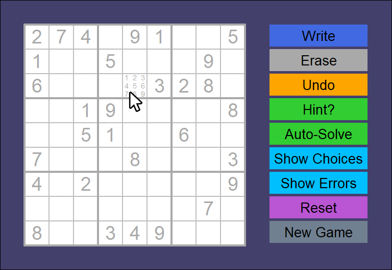
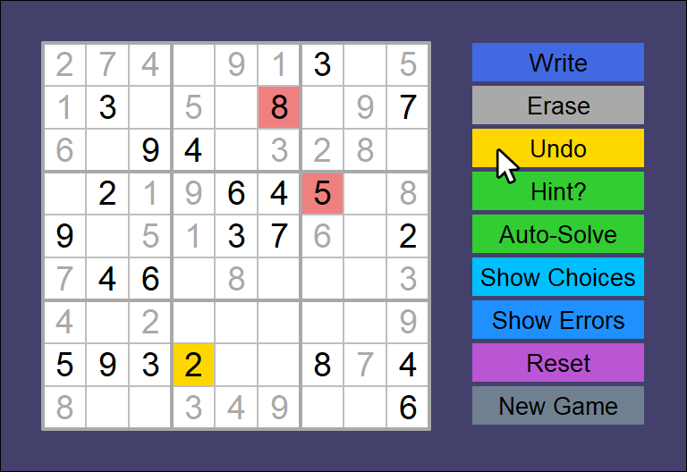
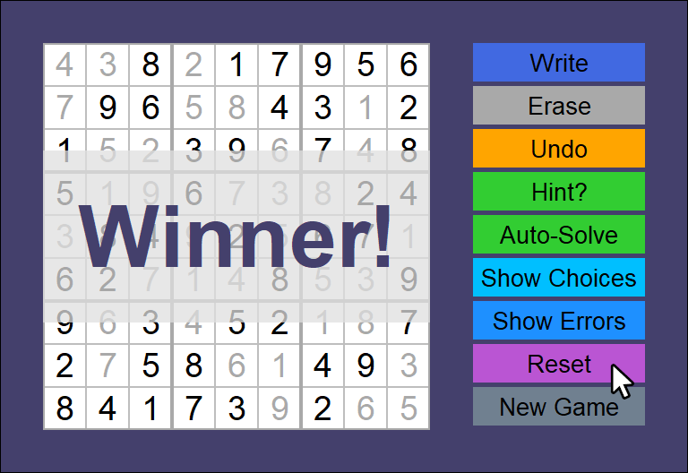

# Smooth Sudoku
## About
I developed this program as a culmination of all design patterns learned after 
completing a course in **Systematic Program Design** at UBC. That curriculum 
(CPSC 110) is based on [How to Design Programs](http://htdp.org/).

1. The earliest roots of the sudoku solving algorithm used in this code were 
from a backtracking search problem taught in class instructional materials. The 
original problem used a rudimentary brute-force search tree.

2. During class term, I accepted an extra challenge to redesign the same solver 
algorithm using constraint sets. Redesigning the data types and functions this 
way allowed the new algorithm to become much more efficient. 

3. For this current project after term ended, I designed and built a full
sudoku game with GUI that employs multiple variations on the constraint 
set algorithm. My game includes several features that make use of those 
constraint sets (e.g. autosolve mode, hint system, error tracking, and 
show choices).

My approach to this project used top-down systematic design and thorough 
**test-driven development** at every step. The code is written in racket's 
_Intermediate Student_ language using the [HtDW](https://world.cs.brown.edu/) 
framework for building interactive programs.

## Features

_Smooth Sudoku's_ features and GUI are designed for a smooth and streamlined user experience. All input is through the mouse.

- In standard mode, hovering over any empty square in _Write_ mode will reveal clickable options to fill.
- Switching to _Erase_ mode in the top right allows to remove user-filled numbers with a click. 

- Optional _Show Errors_ feature automatically highlights incorrect number placements, softening game difficulty.
- Convenient _Undo_ feature (with yellow highlight on mouse hover) allows quick backtracking on previous moves.

- Optional _Show Choices_ feature provides another way to soften difficulty by showing and allowing only valid number placements.
- The _Hint_ hover feature highlights one most recent error OR a square with fewest valid options. Clicking applies the hint.

- For a step-by-step speedthrough that removes all errors and adds missing values to a puzzle, click *Auto-Solve*.
- Players can reset a puzzle to its original state or start a new puzzle via. options in the bottom-left.

## User Information
### COMPATIBILITY
#### To run from source code:
- DrRacket 8.1+
- Language: Intermediate Student with lambda

_**HOW TO INSTALL:**_ Install the latest version of [DrRacket](https://racket-lang.org/). Download and open the [play-sudoku.rkt](/play-sudoku.rkt) source file in DrRacket, then run the program using the DrRacket IDE.

#### To run .exe release file:
- Windows 10+

_**HOW TO INSTALL:**_ Download the latest .exe release from [this repo folder](/play-sudoku/), then run the application.

### USING THE PROGRAM
- On running the program, the game interface window will appear. Interact with it using the mouse to play.
